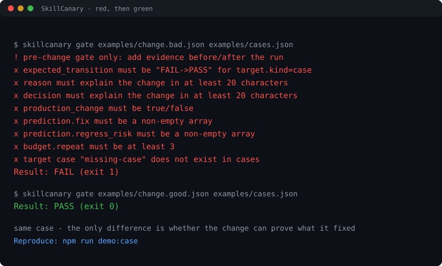

# SkillCanary

**规则要靠「被加载」才生效。机制不靠。**

给 AI 写规则的人迟早会撞上同一堵墙：你以为规则生效了，其实它经常没被读到 —— 上下文太长被裁掉，任务不走那条路，懒加载到需要时已经晚了。**没被加载的规则，和没写过没区别。**



一条命令复现：`npm run demo` —— 同一个 case 先红后绿再变红，外加一次 anchor 漂移检测；如果哪天它不再翻转，这个命令自己会失败

镜像仓库：**https://github.com/ww123dd/skillcanary**（内容与 Gitee 同步；两边 tag 一致）

接着是堆积。规则越沉淀越多，上下文越来越挤，AI 不是越来越听话，是越来越难用：注意力被稀释，规则之间开始互相打架。

更难处理的是模型升级。你为弱模型写的那些「别这么干、必须那么干」，到了强模型身上就成了枷锁。规则约束的是过程，模型越强，越容易被旧规则拖住。

最要命的是你根本不知道改动有没有落实：规则加载了吗，执行了吗，结果是真的还是碰巧。

你说「让 AI 记住，下次别再犯」。可「记住」本身也要靠加载和注意力，它还是会漏。

所以这件事不该在规则上解决。把每一次翻车变成一道必须通过的题：AI 记不记得住不重要，它必须过了这道题才能合。**规则约束过程，机制约束结果** —— 模型越强，过题应该越容易，而不是越被旧规则捆住。

它只问三件事：这次改的是哪道题；改之前它是不是坏的，证据在哪；改之后同一道题、同一套判据重跑，过了没有，别的题坏了没有。三个月后判据漂了，旧结论就作废。

它不评模型，也不管你怎么跑。算不出来的事实，就不算通过。它也不会说「这个 skill 变好了」，只会说这道题关掉了、别的题没被弄坏。

30 秒先看它能用，再看你还缺什么：

接上唯一的自动采集器（默认 dry-run，不写任何东西）：

```bash
skillcanary hook install --host claude          # 先看它会写什么
skillcanary hook install --host claude --write  # 备份后合并；再跑一次不会重复
```

```bash
# 1) 先看它工作：红 -> 绿 -> 再红（clone 下来跑，不装进系统）
git clone https://gitee.com/review-for-qing-lazy/skillcanary
cd skillcanary && npm run demo

# 2) 再看你自己那个 skill 还缺什么
npx --yes git+https://gitee.com/review-for-qing-lazy/skillcanary.git doctor <你的 skill 目录>
```

## 这套东西自己也在跑回归

`benchmarks/real/` 里是真实回归用例。每条都有来源、改动、前后观测和一个**可执行的 run**——跑不过就是跑不过。按它自己的规矩：没有可执行 run 的用例不算证据，也不许编造别人的事故。

```bash
npm run benchmark:real            # 跑一遍，打印表格和失败详情
npm run benchmark:real:validate   # 校验用例格式

# 让它跑自己：4 次真实执行 -> trials.jsonl -> 真实 Pass^4
npm run selfcheck:trials
```

current bench: 46

这个数字由一条用例保证与用例表一致：改了用例不更新这里，基准就会红。

其中几条来自这个项目自己的翻车——demo 里那句**永远不会失败的断言**、README 里那张**无法从代码复现的图**、以及发布前差点一起公开的规划文档。这三条现在都是回归用例。

---

**A rule only works if it gets loaded. A mechanism does not.**

Depending on load is the first wall. Your rule sits in a skill file or a prompt, you assume it is in effect, and half the time it is not: the context got truncated, the task never took that branch, or lazy loading came too late. A rule that was not loaded is no different from a rule that was never written.

Then comes the pile-up: more rules, less room, and an AI that gets harder to use rather than better behaved. Then the model upgrade: constraints you wrote for a weaker model become a cage around a stronger one. And through all of it you cannot tell whether a change actually landed.

"Make the AI remember so it does not repeat the mistake" does not hold either, because remembering also depends on loading and attention.

So do not solve it with another rule. Turn the failure into a case the change has to pass. Rules constrain the process; mechanisms constrain the result. SkillCanary asks three things — which case is this, was it failing before and where is that evidence, and does it pass the same case under the same criteria on a re-run without breaking the others.

## The pain it targets

| User pain | What SkillCanary does |
|---|---|
| "It drifted again." | Requires a case or deterministic target and a measurable transition. |
| "The tool call failed." | Treats MCP boundaries, fallback, offload and veto mapping as first-class checks. |
| "I cannot prove the change helped." | Stores before/after evidence and verifies provenance and hashes. |
| "The same failure keeps coming back." | Converts incidents into advice candidates and executable regressions. |
| "We keep adding rules forever." | Measures correction, rework and tool-error budgets and stops the loop. |
| "I do not know what to fix next." | Records state/action/outcome and recommends the next action. |

## Quick start

```bash
skillcanary doctor ./skills/my-skill
```

`doctor` is the single entry point. It reports the current skill, hook, evidence and error-budget state and gives the next action.

Full loop:

```bash
skillcanary init . --with-action
skillcanary import auto runner-result.json --case c01 --skill my-skill --output .skillcanary/change.json
skillcanary gate .skillcanary/change.json .skillcanary/cases.json --require-provenance
skillcanary anchor ./skills/my-skill --check
skillcanary hook doctor
skillcanary release preflight
```

Store evidence:

```bash
skillcanary evidence normalize raw-result.json --output evidence.json
skillcanary evidence record evidence.json --log .skillcanary/evidence.jsonl
skillcanary store index --input .skillcanary/evidence.jsonl --dir .skillcanary/store
skillcanary store query --dir .skillcanary/store --verdict FAIL->PASS --json
```

Track whether the change helped:

```bash
skillcanary budget ingest sessions.json --output .skillcanary/outcomes.jsonl
skillcanary budget check --input .skillcanary/outcomes.jsonl --config .skillcanary/budget.json
```

> Until the first npm release, replace `skillcanary` with `node bin/skillcanary.js`.

## The loop

### 1. Observe

Real sessions and runner artifacts become failure signals. The scanner is local-first and produces advice candidates, not permanent rules.

### 2. Decide

A change must state:

- the target case or deterministic check;
- the expected transition;
- what should be fixed;
- what might regress;
- the repeat budget.

### 3. Gate

`gate` rejects observation-only, held-out, flat, under-repeated or unlinked changes. With `--require-provenance`, it also verifies independent review and evidence-file hashes.

### 4. Store

`eval_run` and `eval_case_score` are materialized as queryable records. A generic SQL export is available for teams that need their own database.

### 5. Learn

Outcome signals feed the error budget and policy engine. The first policy implementation is a UCB contextual bandit. It is deliberately small; it is a baseline for learning which improvement action works for a failure mode.

## Why it is different

| Existing layer | Its job | SkillCanary relationship |
|---|---|---|
| skillgrade / agent-skills-eval / promptfoo | Run and grade evals | Import their artifacts with `import auto` |
| skills-best-practices | Explain how to write a skill | Turn recommendations into executable checks |
| skillwarden / skillguard / skillgate | Security scanning and install policy | Keep security separate; consume results when available |
| SkillSeal | Fingerprints and signatures | Future provenance integration |
| skillrot / SkillDrift | Detect drift | Treat drift as one signal to the gate |
| Registry | Distribute skills | Gate changes before publish |

The differentiator is not another check. It is the closed loop:

> **Observe a real failure. Decide the change. Gate the evidence. Store the outcome. Learn the next move.**

## Commands

| Command | Purpose |
|---|---|
| `doctor [skill]` | Unified reliability status and next action. |
| `init` | Create change, cases, budget and hook examples. |
| `lint` | Validate skill structure, references and portability. |
| `gate` | Enforce targets, evidence, provenance and held-out rules. |
| `anchor` | Hash skill files and detect drift. |
| `mcp-onboard` | Validate MCP boundaries, fallback, offload and veto mapping. |
| `import <runner|auto>` | Convert runner artifacts into changes. |
| `evidence` | Normalize, append and summarize evidence envelopes. |
| `store` | Materialize, query and export eval tables. |
| `budget` | Derive correction, rework and tool-error signals. |
| `scan / advice / promote / armor / track` | Extract candidates and track outcomes. |
| `hook` | Host-neutral session and tool-event adapter. |
| `policy` | Record decisions, run Pareto/drift analysis and compare algorithms. |
| `trajectory` | Compute six-dimensional trajectory metrics. |
| `reliability` | Estimate pass^k, compare trials and compose step reliability. |
| `grader` | Calibrate judges and select grader strategy. |
| `execution` | Audit deterministic/workflow/agent/human modes. |
| `golden` | Curate capability and regression golden sets. |
| `adapter` | Normalize runner, scanner, trace, registry and MCP artifacts. |
| `active rank` | Rank failure candidates by information value. |
| `drift check` | Detect change-point drift in outcomes. |
| `release preflight` | Check metadata, credentials and privacy before publish. |

## Current proof

- 59 deterministic regression cases: 0 false positives, 0 false negatives.
- 21 executable self-regression cases.
- Six-dimensional trajectory metrics, pass^k reliability, calibrated grader routing and execution-mode auditing.
- Canonical adapters for runner, security, trace, registry, provenance, MCP and EvalPort artifacts; SARIF, JUnit, EvalPort and OTel export.
- Safe policy lab with greedy, UCB, Thompson, hybrid, Pareto and CUSUM drift analysis.
- Provenance gate implemented with SHA-256 evidence verification.
- Evidence store implemented with JSONL materialization and SQL export.
- Error budget implemented.
- Hook doctor implemented.
- Privacy and release preflight implemented.
- English and Chinese documentation shipped.

This is an alpha. The hosted dashboard, cross-repository meta-learning and signed artifacts are planned, not shipped.

## Algorithm lab

The policy engine now supports:

- greedy, UCB, Thompson and hybrid policies;
- Beta posterior uncertainty;
- Pareto analysis across fixed, regression, correction, rework, tool-error and cost objectives;
- CUSUM drift detection;
- active case ranking;
- deterministic simulation with fixed seeds.

```bash
skillcanary policy simulate --horizon 100 --seed 7
skillcanary policy pareto --log .skillcanary/decisions.jsonl
skillcanary policy drift --log .skillcanary/decisions.jsonl
skillcanary active rank .skillcanary/advice.jsonl --top 10
skillcanary drift check .skillcanary/outcomes.jsonl
```

## Adapter control plane

SkillCanary does not need to re-implement every runner or scanner. Adapters normalize external artifacts into canonical envelopes:

```bash
skillcanary adapter list
skillcanary adapter detect result.json
skillcanary adapter import security result.json --output risk.json
skillcanary adapter export result.json --format sarif --output result.sarif
skillcanary adapter doctor
```

The core manages evidence contracts, gates, storage and policy. The adapter owns vendor-specific translation.

## Install from source

```bash
git clone <your-fork-or-repo>
cd skillcanary
node bin/skillcanary.js doctor examples/basic-skill
npm test
npm run benchmark
npm run benchmark:real
```

## Documentation

- [Positioning](docs/positioning.md)
- [Competitive landscape](docs/competitive-landscape.md)
- [Pain points](docs/pain-points.md)
- [Evidence model](docs/evidence-model.md)
- [Evidence storage](docs/evidence-storage.md)
- [Error budget](docs/error-budget.md)
- [Policy engine](docs/policy-engine.md)
- [Algorithms](docs/algorithms.md)
- [Adapter protocol](docs/adapters.md)
- [Compatibility](docs/compatibility.md)
- [Trajectory metrics](docs/trajectory-metrics.md)
- [Reliability](docs/reliability.md)
- [Grader orchestrator](docs/grader-orchestrator.md)
- [Execution modes](docs/execution-modes.md)
- [Golden set](docs/golden-set.md)
- [Runtime layers](docs/architecture/runtime-layers.md)
- [Integrations](docs/integrations/README.md)
- [Threat model](docs/threat-model.md)
- [Non-goals](docs/non-goals.md)

## Safety and privacy

- Session scanning is local-first.
- Raw sessions must not be committed to a public repository.
- Public repositories must not contain internal paths, credentials, business terms or user transcripts.
- High-risk actions require human approval.
- Blocking promotion requires deterministic evidence and a must-fail canary.
- Hook rules are local policy, not a sandbox.
- The error budget is a stop signal to collect new incidents, not a reason to add more rules.

## Status

`skillcanary@0.9.0` - Alpha, dependency-free, cross-platform.

Agent execution is delegated to runners such as `skillgrade`, `agent-skills-eval`, `promptfoo` or your own harness.

## License

MIT
